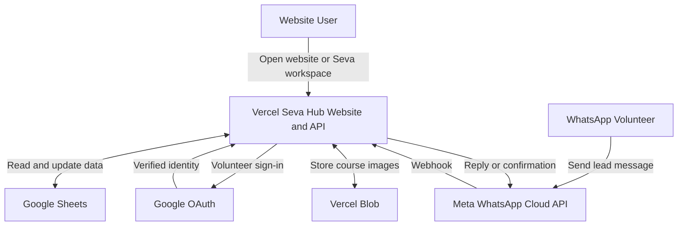

# Seva Hub

Seva Hub is the community app built on top of AOLT Tools. It provides the public
website, volunteer `/seva` workspace, Google sign-in, Google Sheets backed lead
and member management, course activity publishing, short URLs, Vercel Blob image
storage, and WhatsApp lead capture.

This guide is for installing and configuring Seva Hub from the framework
repository.

## Local Development

From the repository root:

```bash
pnpm install
pnpm run dev:seva.hub
```

Open:

```text
http://localhost:5173
```

The app runs in mock mode by default. This is enough for UI development and does
not require Google, Meta, Sheets, or Blob credentials.

For local full-stack testing, use the app-specific Vite development server for UI work. Production API routing is defined by `apps/seva.hub/vercel.json`.

## Vercel Project Settings

Vercel should deploy Seva Hub as the main UI with these settings:

```text
Install Command: pnpm install
Root Directory: apps/seva.hub
Build Command: pnpm build
Output Directory: dist
```

These values are defined in `apps/seva.hub/vercel.json`.

## Prerequisites

Prepare these accounts and resources:

- GitHub account or repository access.
- Vercel account.
- Google account and Google Cloud project.
- Meta/Facebook developer account.
- Dedicated WhatsApp number controlled by the organization.

For an organization installation, prefer dedicated organization-owned Google,
Meta/Facebook, Vercel, and WhatsApp resources instead of one volunteer's personal
accounts.

## Architecture



## Google Sheet

The easiest setup is one Google spreadsheet for all app data.

Generate or use the included template:

```bash
node apps/seva.hub/scripts/generate-sheet-template.mjs
```

Template location:

```text
apps/seva.hub/docs/templates/seva-hub-sheets-template.xlsx
```

Upload the template to Google Drive and open it with Google Sheets. The
spreadsheet should contain:

- `Campaigns`
- `Leads`
- `Members`
- `Activities`
- `CourseTemplates`
- `ShortUrls`
- `Config`
- `AllowedUsers`

Add the first volunteer to `AllowedUsers`:

```text
email,name,mobile
volunteer@example.com,Volunteer Name,919999999999
```

The `Config` tab should include `centerWhatsappNumber` in international format
without `+`, for example:

```text
918884560660
```

Run the Seva Hub Sheet doctor after configuring `.env`:

```bash
node apps/seva.hub/scripts/sheets-doctor.mjs
node apps/seva.hub/scripts/sheets-doctor.mjs --fix
```

The fix command creates missing tabs and headers. It does not remove unknown
columns or app data.

## Google Cloud And OAuth

Enable the Google Sheets API in the Google Cloud project.

Create a Service Account, download its JSON key, and copy:

```text
client_email
private_key
```

Share the Google Sheet with the Service Account email as Editor.

Create a Google OAuth Web Application client and add this authorized redirect
URI:

```text
https://YOUR-DOMAIN/api/seva/auth/callback
```

Use the same URL for `GOOGLE_REDIRECT_URI`.

## Vercel Blob

Seva Hub uses Vercel Blob for course activity images.

In the Vercel project:

1. Open Storage.
2. Create a Blob store.
3. Use Public access so `/courses` can display uploaded activity images.
4. Connect the store to Production and Preview if needed.
5. Add the generated `BLOB_READ_WRITE_TOKEN` to the project environment.

## WhatsApp Cloud API

Use a dedicated WhatsApp number.

Create/configure a Meta app with the WhatsApp product and record:

```text
META_VERIFY_TOKEN
META_ACCESS_TOKEN
META_PHONE_NUMBER_ID
META_APP_SECRET
```

After the Vercel deployment is ready, configure the webhook callback URL in Meta:

```text
https://YOUR-DOMAIN/api/seva/whatsapp/webhook
```

Subscribe to the required WhatsApp message events. `META_APP_SECRET` is used to
verify incoming webhook signatures.

## Environment Variables

Set these in Vercel for Production. For local API testing, place them in
`apps/seva.hub/.env` or `apps/seva.hub/.env.local`.

```text
VITE_APP_MODE=api
APP_DATA_MODE=sheets

GOOGLE_CLIENT_ID=
GOOGLE_CLIENT_SECRET=
GOOGLE_REDIRECT_URI=https://YOUR-DOMAIN/api/seva/auth/callback

SESSION_SECRET=
SESSION_COOKIE_NAME=seva_hub_session

GOOGLE_SHEETS_DATA_SPREADSHEET_ID=
GOOGLE_SHEETS_ACCESS_SPREADSHEET_ID=
GOOGLE_SERVICE_ACCOUNT_EMAIL=
GOOGLE_SERVICE_ACCOUNT_PRIVATE_KEY=

BLOB_READ_WRITE_TOKEN=

META_VERIFY_TOKEN=
META_ACCESS_TOKEN=
META_PHONE_NUMBER_ID=
META_APP_SECRET=
META_API_VERSION=v21.0
WHATSAPP_PENDING_TTL_SECONDS=300
```

Notes:

- `SESSION_SECRET` must be a random value with at least 32 characters.
- Leave `GOOGLE_SHEETS_ACCESS_SPREADSHEET_ID` unset when `AllowedUsers` lives in
  the same spreadsheet as the app data.
- Preserve line breaks in `GOOGLE_SERVICE_ACCOUNT_PRIVATE_KEY`. If Vercel stores
  it as one line, use `\n` for line breaks.
- Only `VITE_APP_MODE` is exposed to browser code. Do not put secrets in
  `VITE_*` variables.

Validate app-local environment values:

```bash
pnpm --dir apps/seva.hub env:check
```

## Public URLs

After deployment, test:

```text
https://YOUR-DOMAIN/
https://YOUR-DOMAIN/seva
https://YOUR-DOMAIN/courses
https://YOUR-DOMAIN/go/sample
```

Canonical API paths:

```text
/api/seva/auth/signin
/api/seva/auth/callback
/api/seva/auth/session
/api/seva/auth/signout
/api/seva/bootstrap
/api/seva/leads
/api/seva/courses
/api/seva/whatsapp/webhook
```

## Deployment Checklist

- Dedicated organization accounts prepared.
- Dedicated WhatsApp number prepared.
- Google Sheet created from `seva-hub-sheets-template.xlsx`.
- First volunteer added to `AllowedUsers`.
- Google Sheets API enabled.
- Service Account created and shared with the Sheet as Editor.
- Google OAuth client created.
- Google redirect URI set to `/api/seva/auth/callback`.
- Vercel project Root Directory set to `apps/seva.hub` and build command set to `pnpm build`.
- Vercel output directory set to `dist`.
- Public Vercel Blob store connected.
- Required environment variables added.
- Domain connected in Vercel.
- Meta webhook set to `/api/seva/whatsapp/webhook`.
- Sheet doctor passes.
- Allowed Google user can open `/seva`.
- Denied Google user cannot access `/seva`.
- Lead/member edits save to Google Sheets.
- Course image upload works.
- WhatsApp lead capture works.

## Quality Commands

From the repository root:

```bash
pnpm run lint
pnpm run typecheck
pnpm run typecheck:seva.hub
pnpm test
pnpm --dir apps/seva.hub build
```

## Troubleshooting

If Vercel shows the framework starter instead of Seva Hub, check the Vercel
project settings:

```text
Root Directory: apps/seva.hub
Build Command: pnpm build
Output Directory: dist
```

If Google sign-in fails, verify that these match exactly:

```text
GOOGLE_REDIRECT_URI
Google OAuth Authorized Redirect URI
https://YOUR-DOMAIN/api/seva/auth/callback
```

If WhatsApp verification fails, verify:

```text
META_VERIFY_TOKEN
META_APP_SECRET
https://YOUR-DOMAIN/api/seva/whatsapp/webhook
```

If Sheets fail to load, verify:

```text
GOOGLE_SHEETS_DATA_SPREADSHEET_ID
GOOGLE_SERVICE_ACCOUNT_EMAIL
GOOGLE_SERVICE_ACCOUNT_PRIVATE_KEY
Sheet sharing permission for the Service Account
```

If course image upload fails, verify:

```text
BLOB_READ_WRITE_TOKEN
Public Blob store access
Blob store connected to the Vercel environment being tested
```
