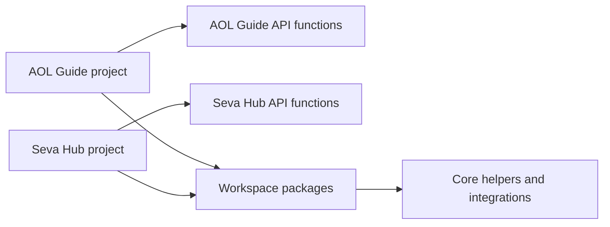

# Architecture

This repository is a pnpm workspace with two Vercel applications:

- `apps/aol.guide`
- `apps/seva.hub`

The repository root is not a Vercel application. Each app owns its own
`package.json`, `vite.config.ts`, `tsconfig.json`, `vercel.json`, static build,
and `api/` directory.

Shared code lives under `packages/` and is consumed through explicit workspace
dependencies:

- `packages/shared`: common contracts and shared type declarations
- `packages/core`: API primitives, browser API client, errors, environment,
  Indian PIN/mobile/email normalization, IST date helpers, and local `.env`
  loading
- `packages/integrations`: Google OAuth/Sheets, Vercel Blob, WhatsApp,
  Mapbox Temporary Geocoding, Gemini JSON generation, and idempotency
  integrations

AOL Guide deploys only:

- `apps/aol.guide/api/search.ts`

It is an NLP wrapper over official Art of Living / VVMVP / Vaidic Puja search pages. It does not keep a course database or run sync jobs.

Seva Hub deploys only:

- `apps/seva.hub/api/auth.ts`
- `apps/seva.hub/api/bootstrap.ts`
- `apps/seva.hub/api/courses.ts`
- `apps/seva.hub/api/leads.ts`
- `apps/seva.hub/api/health/sheets.ts`
- `apps/seva.hub/api/whatsapp/webhook.ts`

Server helpers must stay outside an app's `api/` directory unless they are an
intended public Vercel Function entrypoint.
